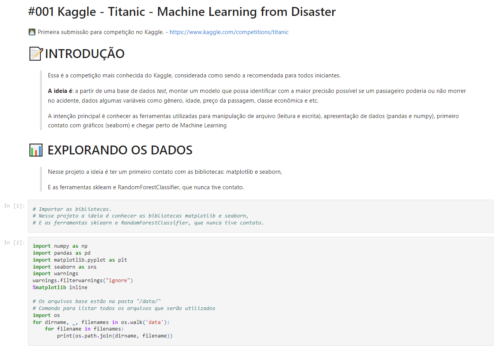

# 001 Titanic - Machine Learning from Disaster

> Essa é a competição mais conhecida do `Kaggle`, considerada como sendo a mais recomendada para todos iniciantes.
> 
> **A ideia é**: a partir de uma base de dados *test*, montar um modelo que possa identificar com a maior precisão possível se um passageiro poderia ou não morrer no acidente, dados algumas variáveis como gênero, idade, preço da passagem, classe econômica e etc.
> 
Link do projeto: <a href="https://www.kaggle.com/competitions/titanic" target="_blank">https://www.kaggle.com/competitions/titanic</a>  

## 📊 Intenções / Metas
Apesar de saber que não é o melhor momento para começar a olhar para `Machine Learning`, esse projeto do Kaggle serviu para me apresentar algumas ferramentas e conceitos de aprendizado de máquina.  
Foquei em seguir o tutorial da Alex Cook apresentado no Kaggle, para posteriormente acrescentar meus próprios *insghts* e manipulações gráficas.
1. Entender como funciona uma competição do Kaggle;
2. Ter o primeito contato com ferramentas de `Machine Learning`;
3. Ter o primeiro contato com bibliotecas de `Ciência de Dados` como NumPy, Pandas e Matplotlib;
4. Treinar GitHub, Jupyter Lab e Python;
5. Aprender a manipular arquivos e gráficos;
6. Aprender a exportar arquivos, pensando na confecção de relatórios;

## 🗺️ Resumo

 

A competição é simples: Nós queremos usar uma base de dados de passageiros do Titanic (Nome, Idade, Gênero, preço da passagem, etc.) e predizer quem vai morrer e quem vai sobreviver. `~~Sim, macabro~~`
Temos 3 arquivos para o projeto:
* (1) train.csv 
* (2) test.csv
* (3) gender_submission.csv

`train.csv` contém detalhes de diversos passageiros a bordo (891 passageiros, para ser exato). Os valores na coluna `Survived` representam `0 morreu` e `1 sobreviveu`   

`test.csv` Após treinar o modelo com o primeiro arquivo, devemos aplicar o modelo no arquivo `test.csv` e predizer se os 418 passageiros sobreviveram ou não.  

`gender_submission.csv` é um arquivo fornecido pelo desafio para demonstrar como deve ser o resultado. Esse arquivo possui o 'modelo rudimentar' de que todos os homens morreram e todas as mulheres sobreviveram. 
 

`A ideia do desafio é melhorar a acuracidade desse modelo` 

## 🚧 Projeto
> Para visualilizar o projeto completo, juntamente das explicações e considerações, será necessário rodar os arquivos:
* <a href="https://github.com/rafarodrigues/kaggle/blob/main/001_Titanic/001_Titanic.ipynb" target="_blank">`001_Titanic.ipynb` - Arquivo principal do projeto.</a>  

* `001_Titanic.pdf` - Arquivo do Jypyter exportado para PDF; 
* `resultado.csv` - Resultado obtido com o modelo desenvolvido; 
* `../data/` - Pasta com os arquivos utilizados para treino, validação e teste;
* `../img/` - Repositório com as imagens;

## 📑 Ajustes e melhorias

O projeto ainda está em desenvolvimento e as próximas atualizações serão voltadas nas seguintes tarefas:

- [X] Adicionar gráficos e bibliotecas;
- [ ] Melhorar gráficos e adicionar explicações;
- [X] Configurar exportação do Jupyter Notebook para PDF;
- [ ] Adicionar análises e explicações do resultado;
- [ ] Montar e explicar forma de validação dos dados;
- [ ] Montar no README.md passo-a-passo de como organizei o projeto;
- [X] Corrigir '*warnings*' do projeto `001 Titanic`;
- [ ] Finalizar projeto;
- [ ] Retornar em `01/04/2023` e realizar o desafio novamente, já com novos conhecimentos e sem o tutorial da Alex Cook;

## 🚢 Conclusão
*PENDENTE* *PENDENTE* *PENDENTE* *PENDENTE* *PENDENTE* *PENDENTE* *PENDENTE*  

[⬆ Voltar ao topo](#001_Titanic) 
